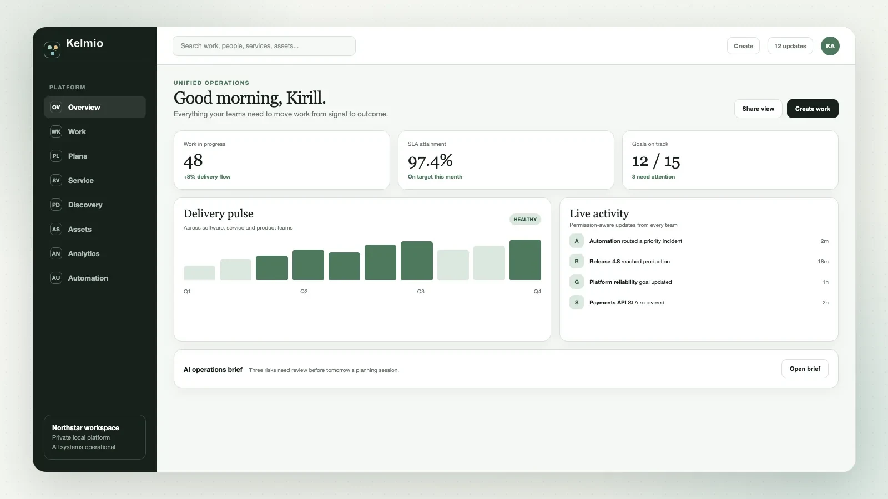
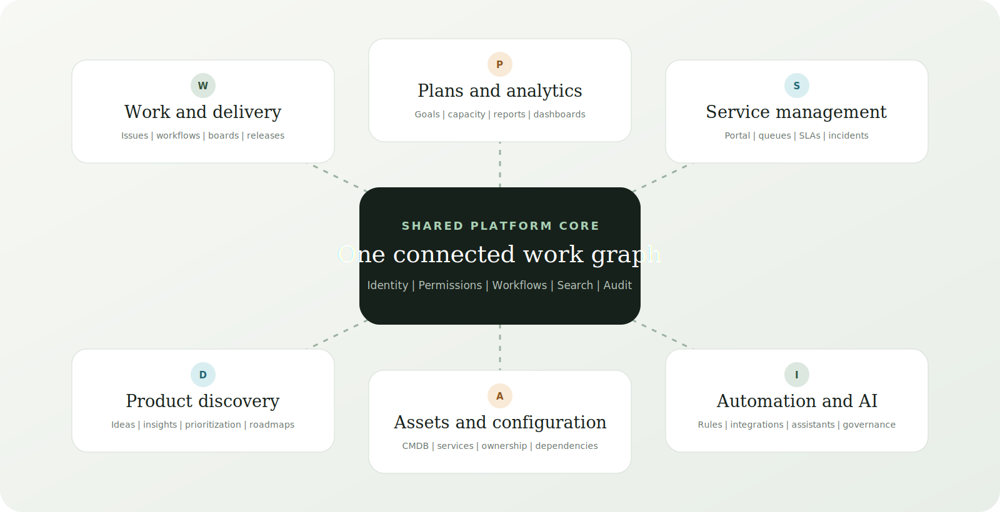
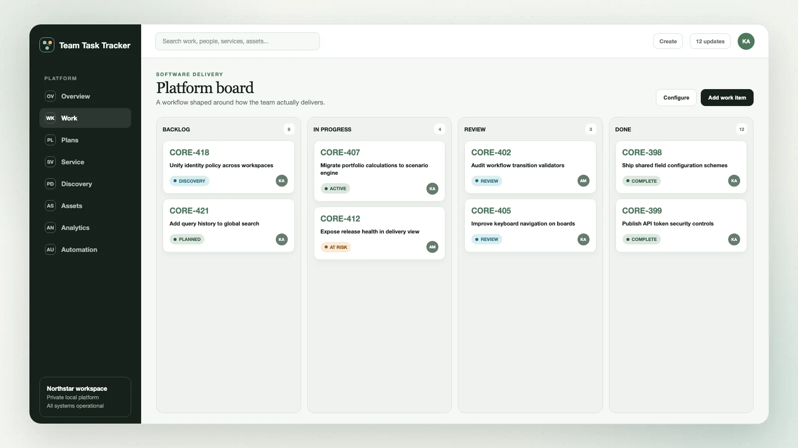
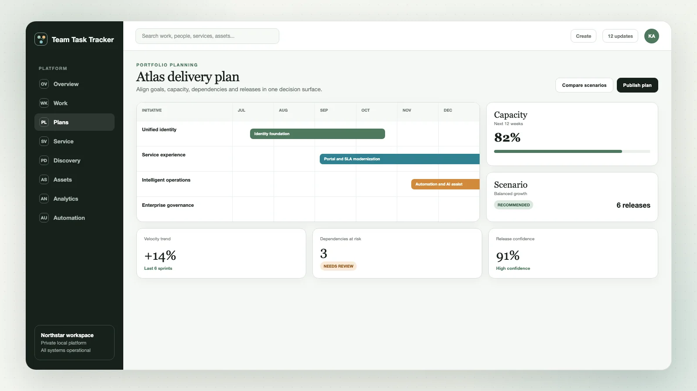
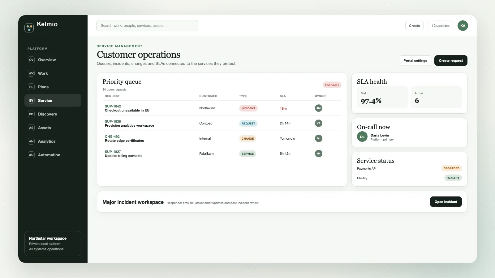
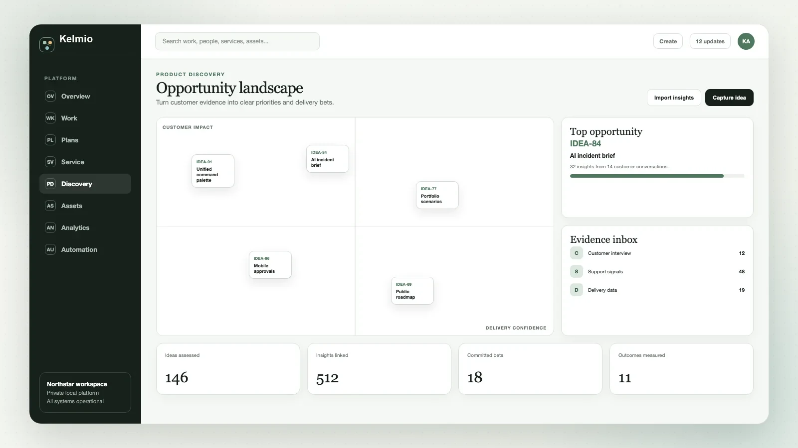
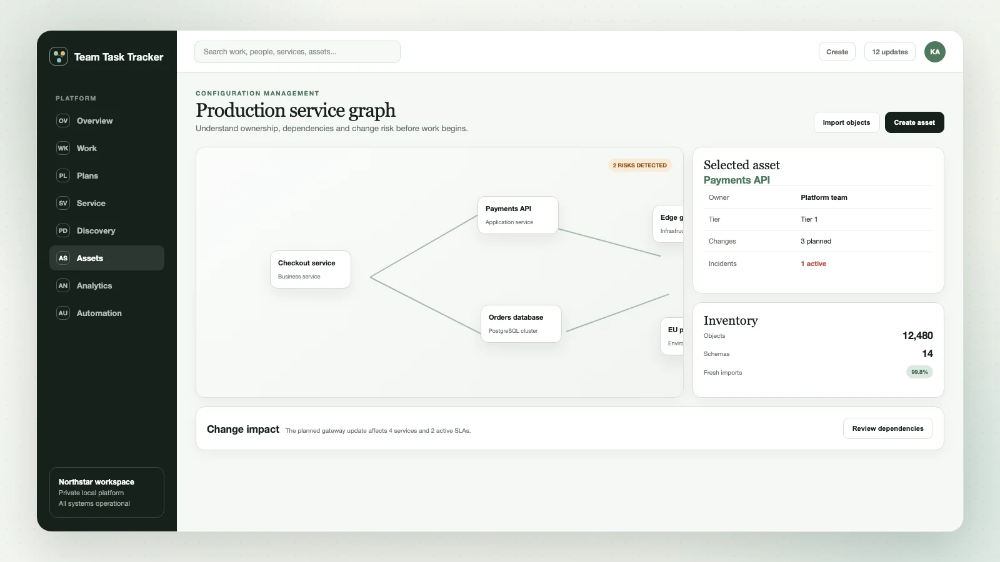
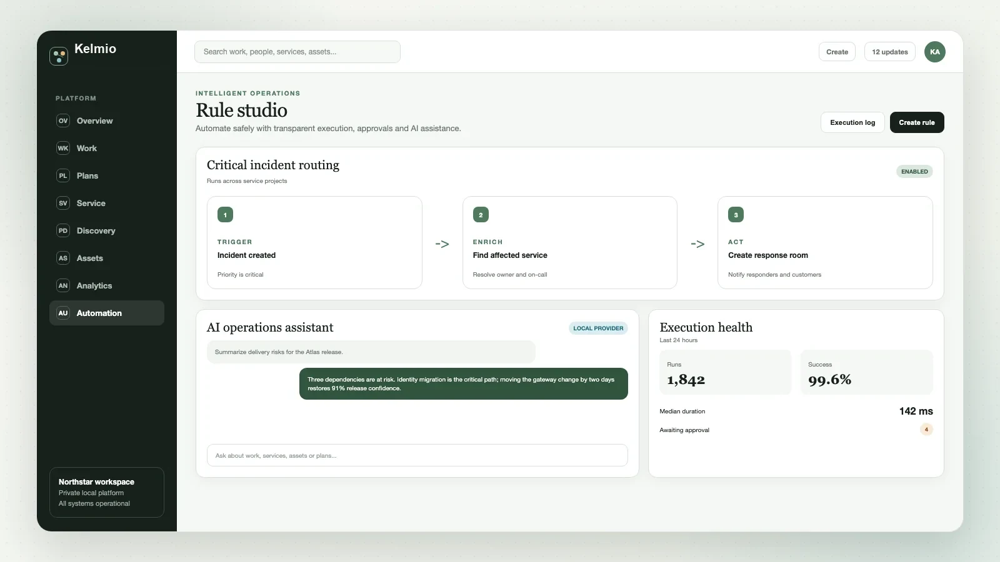

  

<h1 align="center">One local platform to plan, build, support, discover, and operate.</h1>

  Kelmio connects software delivery, service management, product discovery,
  assets, analytics, automation, and AI in one private work platform.

  
  
  
  
  
  
  

  <a href="#why-kelmio">Why Kelmio</a> |
  <a href="#one-connected-platform">Platform</a> |
  <a href="#product-experiences">Product Experiences</a> |
  <a href="#platform-architecture">Architecture</a> |
  <a href="#documentation">Documentation</a>

## Why Kelmio

Kelmio is an original, localhost-first system for organizations that
want one coherent operating model for work without handing their data or
processes to a managed cloud. It combines the functional breadth of modern
work management, agile delivery, service operations, product discovery, and
configuration management while preserving a single identity, permission,
workflow, search, and audit foundation.

<table>
  <tr>
    <td width="50%">
      <h3>Shape the platform around your teams</h3>
      Configure work types, fields, screens, workflows, permissions, boards,
      forms, queues, reports, and automation without fragmenting the data model.
    </td>
    <td width="50%">
      <h3>Move from signal to outcome</h3>
      Connect customer evidence, ideas, goals, plans, delivery work, releases,
      services, incidents, changes, and assets in one traceable work graph.
    </td>
  </tr>
  <tr>
    <td width="50%">
      <h3>Automate with control</h3>
      Build transparent rules, approvals, integrations, and provider-neutral AI
      assistance that always respects permissions and records what changed.
    </td>
    <td width="50%">
      <h3>Own the complete system</h3>
      Run the application, data, email, monitoring, backups, and restore drills
      locally with no dependency on a hosting provider or managed SaaS account.
    </td>
  </tr>
</table>

## One Connected Platform

Every experience shares the same platform core. Teams can work differently
without losing common identity, governance, history, or cross-domain context.

## Product Experiences

### Configurable work management

Create rich work items, custom hierarchies, reusable field and workflow
schemes, strict transition policies, dependencies, releases, and
permission-aware views. Scrum and Kanban teams can shape boards, backlogs,
ranking, swimlanes, WIP limits, quick filters, and card layouts around their
delivery model.

### Planning, goals, and analytics

Coordinate initiatives across teams with dependency timelines, capacity and
scenario planning, goals, releases, and delivery confidence. Turn the same
live data into agile reports, cross-project analytics, dashboards, and
scheduled decision-ready views.

### Service management and operations

Give customers a structured request portal and agents a unified workspace for
queues, SLAs, approvals, incidents, problems, changes, services, on-call
schedules, and escalations. Keep response work connected to owners,
dependencies, delivery teams, and customer communication.

### Product discovery

Capture ideas, feedback, and evidence from every channel. Compare opportunities
with configurable fields and formulas, prioritize transparently, publish
roadmaps, and connect product bets directly to delivery progress and outcomes.

### Assets and configuration management

Model services, infrastructure, devices, applications, owners, and
relationships with typed object schemas and searchable history. Use live
configuration context to understand incident impact, assess change risk, and
connect operational work to the systems it affects.

### Automation, integrations, and AI

Build organization-wide rules with scheduled and event-driven triggers,
branching, smart values, related-entity actions, approvals, execution history,
and diagnostics. Connect external systems through scoped APIs and reliable
webhooks, then add provider-neutral AI for search, summarization, drafting,
triage, and permission-checked actions.

## Built For Every Team

| Team | Connected experience |
|---|---|
| Software delivery | Backlogs, boards, sprints, releases, development context, plans, and reports |
| Product management | Ideas, insights, prioritization, goals, roadmaps, and outcome tracking |
| Service teams | Portals, queues, request types, SLAs, approvals, and knowledge-driven support |
| IT operations | Services, incidents, changes, on-call, assets, dependencies, and automation |
| Leadership | Cross-team goals, portfolio scenarios, dashboards, risks, and delivery confidence |
| Administrators | Organizations, workspaces, identities, groups, schemes, policies, audit, and diagnostics |

## Private By Design

- **Local ownership:** application data, configuration, files, metrics, email,
  backups, and AI provider settings remain under your control.
- **Permission-aware by default:** every search result, report, automation,
  integration, and AI action uses the same authorization model.
- **Auditable operations:** work history, administrative changes, automation
  executions, delivery attempts, and security-sensitive actions are traceable.
- **Recoverable infrastructure:** health checks, metrics, alerts, durable
  workers, scheduled backups, retention, and isolated restore drills are part
  of the platform rather than afterthoughts.

## Platform Architecture

Kelmio is a modular Go and React platform backed by PostgreSQL. A
single transactional domain model supports work, planning, service management,
discovery, assets, governance, and audit. Durable workers handle email,
automation, integrations, scheduled operations, and recovery paths. Versioned
REST APIs, signed webhooks, local object storage, observability, and deterministic
mock providers keep integrations and AI testable without external services.

The system is designed as one local installation with multiple isolated
organizations and workspaces. Production-shaped security and operations can be
validated entirely on localhost, including TLS, permissions, migrations,
monitoring, backup, restore, and full browser regression.

## Documentation

- [Product capability baseline](docs/product-capability-baseline.md)
- [Product roadmap](docs/product-roadmap.md)
- [Self-hosted architecture and operations](docs/self-hosted-deployment.md)
- [Backup and restore](docs/backup-restore.md)
- [V5 operations foundation](docs/v5-plan.md)

---

  <strong>Kelmio is an original independent product with its own name, design,
  architecture, product model, and source code.</strong>

