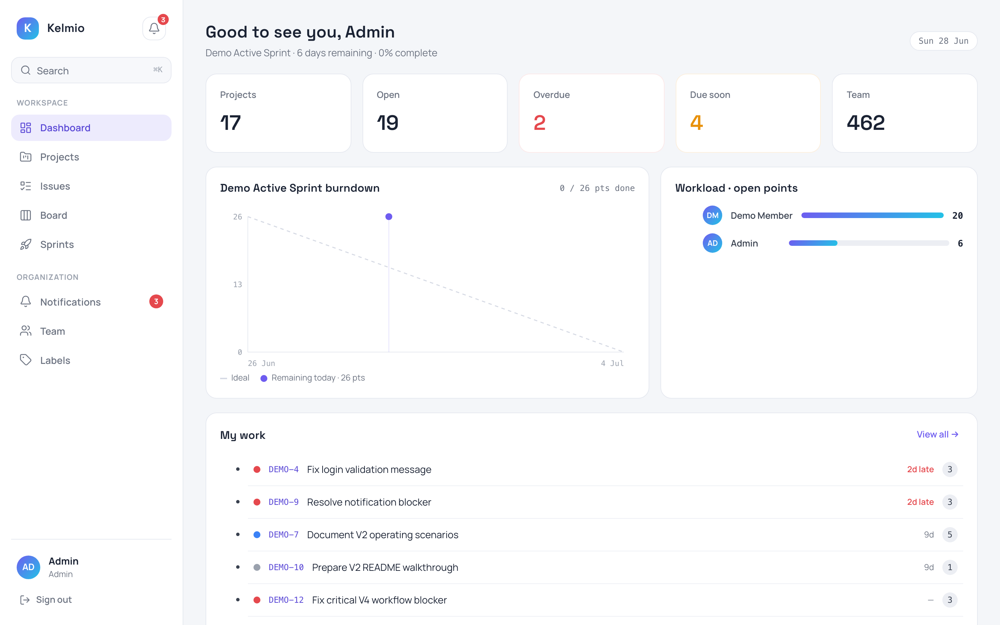
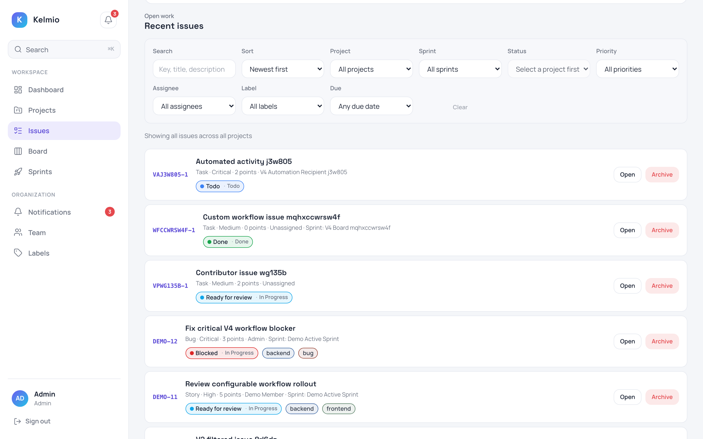
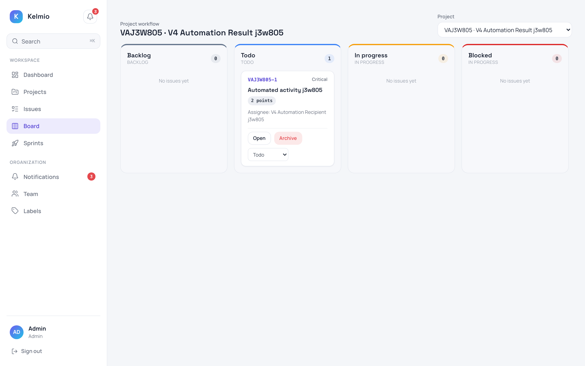
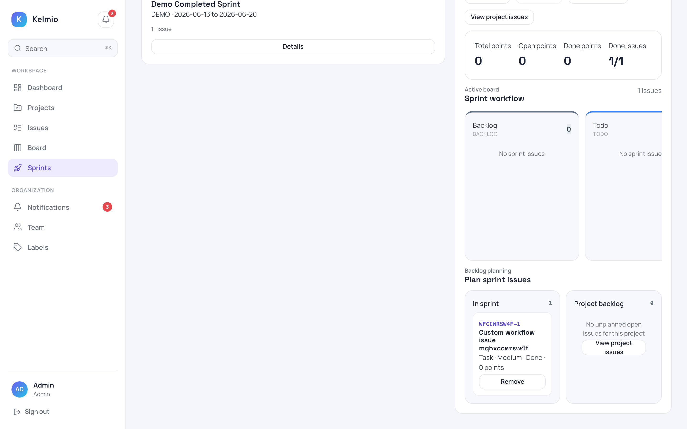
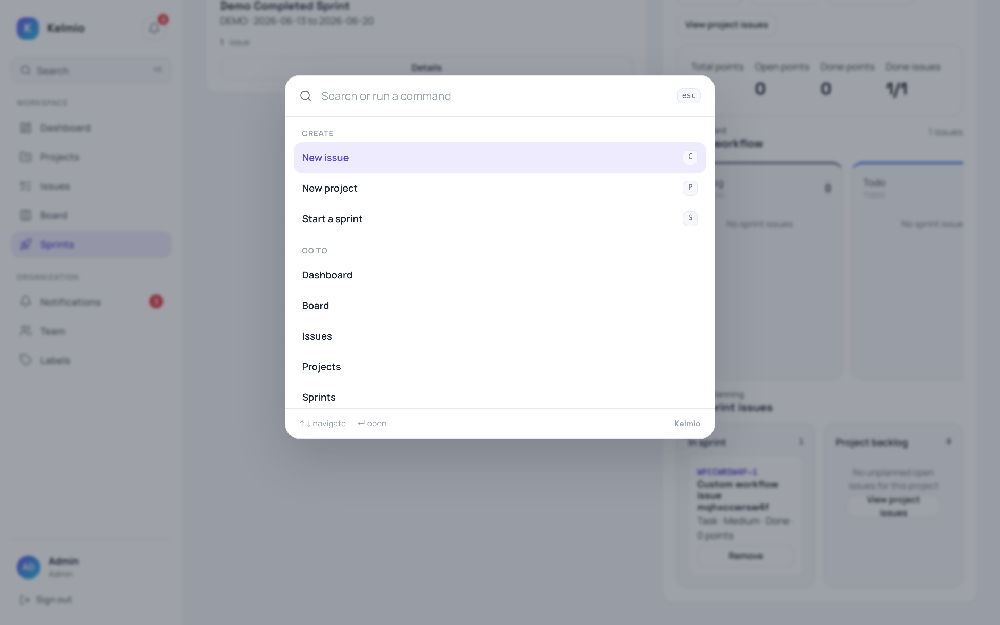

<p align="center">
  
</p>

<h1 align="center">A private, local-first workspace to plan and ship software.</h1>

<p align="center">
  Kelmio is an issue tracker, agile board, and project automation tool you run
  yourself — one calm, command-first app, with no managed cloud.
</p>

<p align="center">
  <a href="https://github.com/kirillalexandrowitsch/kelmio/actions/workflows/ci.yml"></a>
  <a href="https://github.com/kirillalexandrowitsch/kelmio/actions/workflows/full-qa.yml"></a>
  
  
  
  
  
</p>

<p align="center">
  <a href="#why-kelmio">Why Kelmio</a> |
  <a href="#what-you-can-do">What you can do</a> |
  <a href="#private-by-design">Private by design</a> |
  <a href="#architecture">Architecture</a> |
  <a href="#getting-started">Getting started</a>
</p>



## Why Kelmio

Kelmio is an original, localhost-first work tracker for teams that want one
coherent place to plan and deliver work without handing their data to a managed
cloud. Projects, issues, workflows, sprints, boards, notifications, and
automation share a single identity, permission, and history model — and the
whole system runs on your own machine.

<table>
  <tr>
    <td width="50%">
      <h3>Track work end to end</h3>
      Issues with hierarchy, subtasks, comments, labels, links, and full
      activity history — filtered and saved into the views your team reuses.
    </td>
    <td width="50%">
      <h3>Ship on your cadence</h3>
      Configurable project workflows, scrum sprints, and Kanban boards that
      enforce the transitions and permissions you define.
    </td>
  </tr>
  <tr>
    <td width="50%">
      <h3>Automate with control</h3>
      Build typed project rules that run atomically, respect permissions, and
      record exactly what changed in activity and notifications.
    </td>
    <td width="50%">
      <h3>Own the whole system</h3>
      Run the application, database, email, metrics, backups, and restore drills
      locally — no hosting provider or managed SaaS account required.
    </td>
  </tr>
</table>

## What you can do

### Plan and track work

Create issues with types, priorities, story points, due dates, assignees, and
labels. Organize them into parent/subtask hierarchies, link related work, and
follow a complete activity trail. Narrow large lists with rich filters and
persist the combinations your team uses as personal saved views.



### Configurable workflows and boards

Define each project's statuses, colors, categories, and strict transition rules,
and archive a status with a safe replacement when the process changes. Work the
same data on a dynamic project board or the active sprint board, where every
move honours the project workflow and the user's role.



### Agile delivery and insight

Plan, start, and complete sprints with a backlog and story points, then read the
state of delivery at a glance: open, overdue, and due-soon work, team workload by
points, an honest cycle burndown, and a focused "my work" list.



### Move fast with the command palette

Press <kbd>⌘K</kbd> / <kbd>Ctrl K</kbd> anywhere to create work, jump between
sections, and reopen recent issues without leaving the keyboard — part of a
calm, light interface designed for everyday use.



### Teams, roles, and notifications

Manage workspace members and email invites, and grant per-project roles — lead,
contributor, or viewer — with isolation enforced on the server, not just the UI.
Stay in the loop through in-app notifications and mentions for assignments,
comments, sprint events, and automation.

### Account recovery and durable email

Reset forgotten passwords through a safe token flow that never reveals whether an
account exists. System email is delivered through a durable outbox and worker, so
invites and reset links survive transient SMTP failures, with admin-readable
delivery diagnostics.

## Built For

| Team | What they get |
|---|---|
| Software & agile teams | Backlogs, boards, sprints, story points, workflows, and project automation |
| Project leads | Configurable workflows, project roles, sprint planning, and delivery insight |
| Workspace admins | Team management, email invites, labels, and operational health |

## Private By Design

- **Local ownership:** application data, configuration, email, metrics, and
  backups stay on your infrastructure.
- **Permission-aware by default:** project access and roles are enforced
  server-side across issues, boards, sprints, and automation.
- **Auditable activity:** issue changes, comments, transitions, and automation
  executions are recorded and traceable.
- **Recoverable infrastructure:** health checks, Prometheus metrics, local
  alerting, a durable email worker, scheduled backups with retention, and an
  automated restore drill are built in.

## Architecture

Kelmio is a modular Go monolith with a React + TypeScript interface, backed by
PostgreSQL and server-side sessions. A single transactional domain model covers
projects, work items, workflows, sprints, notifications, and automation. A
durable background worker handles system email, and Prometheus metrics, local
Grafana/Alertmanager, scheduled backups, and restore drills cover operations.

Everything runs from Docker Compose on localhost. Production-shaped security and
operations — TLS, permissions, migrations, monitoring, backup, restore, and full
browser regression — can be validated entirely on your own machine.

## Getting Started

```bash
git clone https://github.com/kirillalexandrowitsch/kelmio.git
cd kelmio

make setup-db   # start PostgreSQL, run migrations, and seed demo data
make dev        # run the full stack with Docker Compose
```

Then open <http://localhost:5173> and sign in with the seeded local admin
account. See the [self-hosted operations guide](docs/self-hosted-deployment.md)
for configuration, monitoring, and backups.

## Documentation

- [Product capability baseline](docs/product-capability-baseline.md)
- [Product roadmap](docs/product-roadmap.md)
- [Self-hosted architecture and operations](docs/self-hosted-deployment.md)
- [Backup and restore](docs/backup-restore.md)

---

<p align="center">
  <strong>Kelmio is an original independent product with its own name, design,
  architecture, product model, and source code.</strong>
</p>
